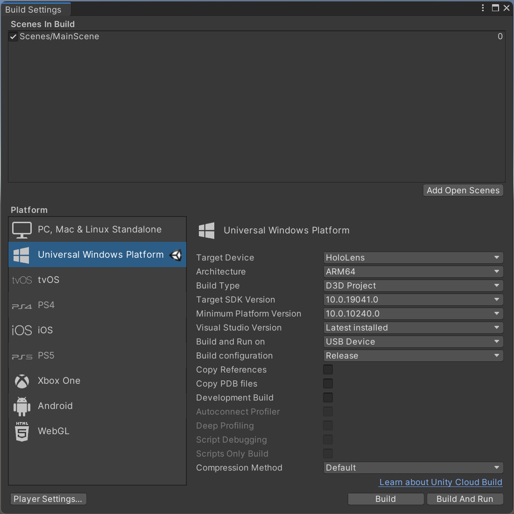

# Re-locations

![The Re-locations prototype from a third-person view in two different rooms. In both rooms, a computer screen and a large touchscreen are surrounded by a blue border. In room 1, a man stands in front of the large touchscreen, wearing an augmented reality head-mounted display. A white upper-body 3D avatar with a green ray hovers in front of the computer screen. In room 2, a woman sits in front of the computer screen, wearing an augmented reality head-mounted display. A white upper-body 3D avatar with a green ray hovers in front of the large touchscreen.](/Figures/teaser.jpg)

This is an initial prototype of the Re-locations concept using the augmented reality head-mounted display Microsoft HoloLens (first generation). The prototype is part of the ISS'22 publication:

>Daniel Immanuel Fink, Johannes Zagermann, Harald Reiterer, and Hans-Christian Jetter. 2022. Re-locations: Augmenting Personal and Shared Workspaces to Support Remote Collaboration in Incongruent Spaces. Proc. ACM Hum.-Comput. Interact. 6, ISS, Article 556 (December 2022), 30 pages. https://doi.org/10.1145/3567709

The paper presentation can be watched [here](https://www.youtube.com/watch?v=GJ-7VsJO4yo).

For questions or feedback, please contact [Daniel Immanuel Fink](https://hci.uni-konstanz.de/members/research-assistants/daniel-fink/) ([GitHub](https://github.com/dunifi91)).

## Setup

Required applications:
- NodeJS 12.20.2 (available [here](https://nodejs.org/download/release/v12.20.2/))
- Unity 2019.4.31f1 (available in the [Unity Download Archive](https://unity.com/releases/editor/archive)) with "Universal Windows Platform Build Support"
- Visual Studio 2022 (please note the required workloads and components for building HoloLens apps [here](https://learn.microsoft.com/en-us/windows/mixed-reality/develop/install-the-tools))

Supported hardware:
- Hololens
- Hololens 2

### Setup Server

1. On the command line, change the directory to the `re-locations-server` folder of the repository.
2. Run `npm install`
3. Run `npm run build`
4. Start the server with `npm start`

### Setup Re-locations App

1. Open the `re-locations` project with Unity 2019.4.31f1 (available at the [Unity Download Archive](https://unity.com/releases/editor/archive)).

#### Vuforia Setup

2. Open the "Package Manager" in Unity (Window -> Package Manager) and install "Vuforia Engine AR" (Version 8.5.9).
3. Re-locations uses the "Vuforia Engine" which requires a license. A Vuforia account can be created [here](https://developer.vuforia.com/vui/auth/login). Afterward, a "Basic" (free) license can be created in the [License Manager](https://developer.vuforia.com/vui/develop/licenses).
4. Open the "Vuforia Configuration" in Unity  (Window -> Vuforia Configuration) and paste your license key into the "App License Key" field.

#### Networking Setup

5. Set the `SERVER_IP` in the `Assets/Colibri/Sync/Code/SyncConfiguration.cs` file to the local IP address of the server (device running the server).  
For example: `public static string SERVER_IP = "192.168.178.101";`

#### Build App

6. Open the "Build Settings" in Unity (File -> Build Settings) and select "Universal Windows Platform" as platform (Make sure the module "Universal Windows Platform Build Support" was added during Unity installation).  
Use the following build settings for HoloLens 2 (for HoloLens 1 select "ARM" as "Architecture"):  
  
Other Target SDK versions may work but have not been tested. The setting "Visual Studio Version" and all subsequent settings can be adjusted to the local installation or preference.
7. Press the "Switch Platform" button.
8. After the platform switch is finished, press the "Build" button and select (or create) a folder in which the project should be built.
9. After the build process is finished, open the created solution `Re-Locations.sln` with Visual Studio and build the app on the HoloLens using the prefered build method. In some cases, the correct architecture must be selected again in Visual Studio.

### Setup Room

1. Print the file `marker_set.pdf` located in the folder `re-locations-marker`.
2. Cut out (at least) the "Calibration Marker" (page 1). It works best when the marker is printed on thick paper or glued on cardboard.
3. In two different rooms, attach a "Room Marker" of the marker set to the wall. The "Room Marker" in the rooms must be different.
4. Perform a room calibration in both rooms using the "Calibration Marker" and the Re-locations App ("Calibrate New Room" button).
5. After the one-time calibration is finished, you only need to look at the "Room Marker" to join a room.
